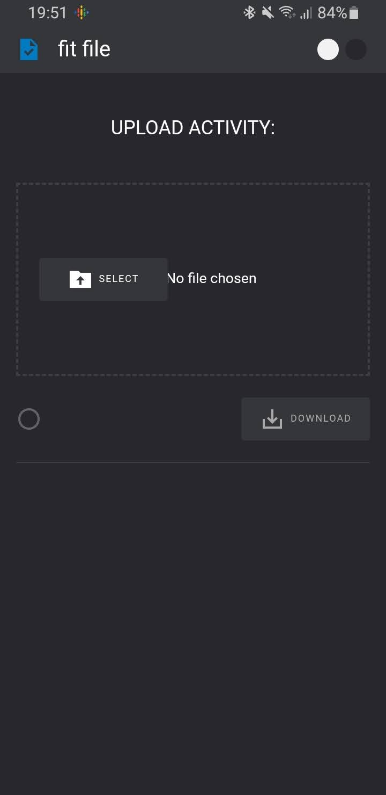
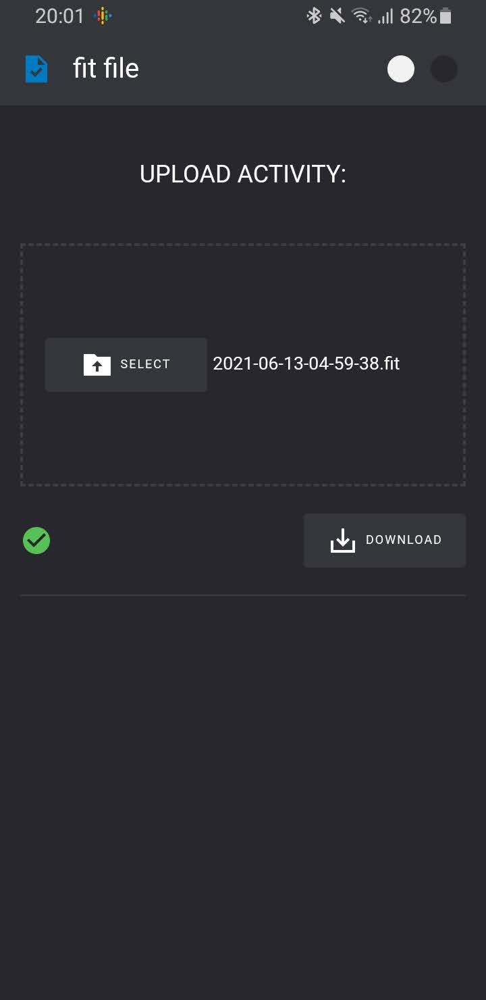
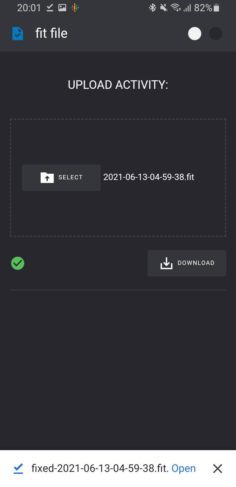

# Fit File

Fit File is a tool for fixing broken .FIT files, exported from Renpho / NexGim bikes. 

## Screenshots

<table>
  <tr>
     <td>
       
     </td>
     <td>
       
     </td>
     <td>
       
     </td>
  </tr>
</table>

## The Tool

[Fit File on vercel](https://fit-file-renpho-strava-3viq3efux-ravbaker.vercel.app/)

## Changelog

- fixes for correct output, compatiblew with Strava, @ravbaker - Oct 27th, 2022
- initial version by [@dvmarinoff](https://github.com/dvmarinoff/FitFile) - Feb 2022

## License 

AGPL 

